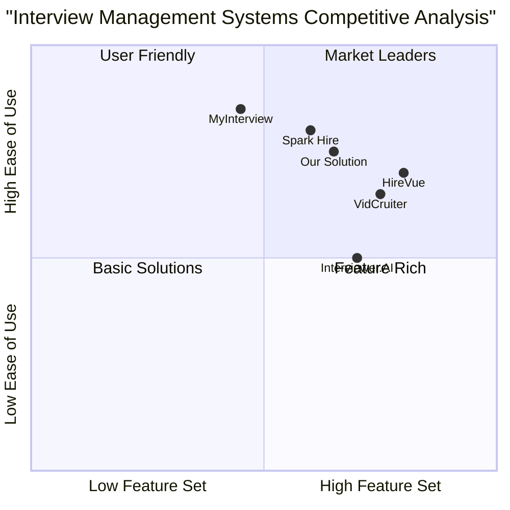

# Product Requirements Document (PRD)
Interview System Admin Panel

## 1. Project Overview

### 1.1 Project Information
- **Project Name**: interview_system_admin_panel
- **Technology Stack**: ASP.NET Core MVC, Entity Framework
- **Date**: 2025-03-05

### 1.2 Original Requirements
Develop an Interview System Admin Panel with role-based access control, company management, interview management, and candidate evaluation features.

## 2. Product Goals
1. Create a secure and efficient interview management system for organizations
2. Streamline the candidate evaluation process through video interviews
3. Provide comprehensive analytics and management tools for interview processes

## 3. User Stories

### As a SuperAdmin
- I want to manage all user roles (SuperAdmin, Admin, User) so that I can control system access
- I want to manage company definitions so that I can maintain organization hierarchy
- I want to view and manage interviews across all companies so that I can oversee the entire system

### As an Admin
- I want to manage Admin and User role accounts within my company so that I can delegate responsibilities
- I want to manage interviews and candidates so that I can coordinate interview processes
- I want to evaluate candidate interviews so that I can make informed hiring decisions

### As a User
- I want to create and manage interviews so that I can conduct candidate evaluations
- I want to add candidates to interviews so that I can process applications
- I want to review interview recordings so that I can evaluate candidates

## 4. Competitive Analysis



### Competitive Analysis Details

1. **HireVue**
   - Pros:
     * Advanced AI-powered analytics
     * Enterprise-grade security
     * Comprehensive integration options
   - Cons:
     * Complex pricing structure
     * Steep learning curve
     * Requires significant setup time

2. **VidCruiter**
   - Pros:
     * Feature-rich platform
     * Good customization options
     * Strong customer support
   - Cons:
     * Higher price point
     * Limited flexibility in workflow
     * Complex implementation

3. **Spark Hire**
   - Pros:
     * User-friendly interface
     * Quick setup process
     * Good value for money
   - Cons:
     * Limited advanced features
     * Basic analytics
     * Limited integration options

4. **MyInterview**
   - Pros:
     * Simple and intuitive
     * Affordable pricing
     * Good basic features
   - Cons:
     * Limited enterprise features
     * Basic reporting capabilities
     * Limited customization

5. **Interviewer.AI**
   - Pros:
     * Strong AI capabilities
     * Good analytics
     * Modern interface
   - Cons:
     * Limited track record
     * Less flexible than competitors
     * Limited integration options

## 5. Technical Requirements

### 5.1 System Architecture
- ASP.NET Core MVC framework
- Entity Framework for data access
- SQL Server database
- Authentication using ASP.NET Core Identity

### 5.2 Requirements Pool

#### P0 (Must Have)
1. **User Management System**
   - Role-based access control (SuperAdmin, Admin, User)
   - User CRUD operations with soft delete
   - Company-specific user management
   - Default SuperAdmin account (admin/admin)
   - FirmId claim management

2. **Company Management**
   - Company CRUD operations (SuperAdmin only)
   - Soft delete functionality
   - Company-user association

3. **Interview Management**
   - Create/Edit/Delete interviews
   - Interview details (title, question, details)
   - Time constraints (max 180 seconds)
   - Start and end date management
   - Soft delete functionality

4. **Candidate Management**
   - Email-based candidate registration
   - Bulk email import
   - UUID v7 implementation
   - Duplicate email handling
   - Interview-candidate association

#### P1 (Should Have)
1. **Interview Listing**
   - Advanced filtering options
   - Company-specific views
   - Status management (Active/Passive/Deleted)
   - Client-side search functionality

2. **Candidate Analysis**
   - Batch analysis operations
   - Individual analysis capability
   - Error handling and retry mechanism
   - Status refresh functionality

#### P2 (Nice to Have)
1. **Review System**
   - Video playback integration
   - Scoring system (0-100)
   - Comment/feedback system
   - Export functionality

### 5.3 Database Schema

#### Core Entities
1. **User**
   - Id (PK)
   - Username
   - Password (hashed)
   - Email
   - Role
   - FirmId (FK)
   - IsDeleted
   - CreatedAt
   - UpdatedAt

2. **Company**
   - Id (PK)
   - Name
   - IsDeleted
   - CreatedAt
   - UpdatedAt

3. **Interview**
   - Id (PK)
   - Title
   - Question
   - Details
   - Duration
   - StartDate
   - EndDate
   - FirmId (FK)
   - IsDeleted
   - CreatedAt
   - UpdatedAt

4. **Candidate**
   - Id (PK, UUID v7)
   - InterviewId (FK)
   - Email
   - Status
   - RegistrationDate
   - InterviewDate
   - VideoUrl
   - IsDeleted
   - CreatedAt
   - UpdatedAt

## 6. UI Design Draft

### 6.1 Common Elements
- Top navigation bar with user info and logout
- Left sidebar with menu items
- Responsive design for all screen sizes
- Consistent color scheme and typography

### 6.2 Key Screens

1. **User Management Screen**
```
+-----------------+
|   Create User   |
+-----------------+
| Username: [    ]
| Password: [    ]
| Email:    [    ]
| Role:     [▼   ]
| Company:  [▼   ]
+-----------------+
|    [Submit]    |
+-----------------+

User List Table
+----------+--------+--------+---------+--------+
| Username | Email  | Role   | Company | Action |
+----------+--------+--------+---------+--------+
|    ...   |   ...  |   ...  |   ...   |  ...   |
```

2. **Interview Management Screen**
```
+------------------------+
|   Create Interview    |
+------------------------+
| Title:      [        ]
| Question:   [        ]
| Details:    [        ]
| Duration:   [      s ]
| Start Date: [        ]
| End Date:   [        ]
+------------------------+
|       [Submit]        |
+------------------------+

Interview List Table
+---------+-----------+------------+----------+--------+
| Title   | Duration  | Start Date | End Date | Action |
+---------+-----------+------------+----------+--------+
|   ...   |    ...    |    ...     |    ...   |   ...  |
```

3. **Candidate Management Screen**
```
+------------------------+
|   Add Candidates      |
+------------------------+
| Interview: [▼        ]
| Emails:    [        ]
|            [        ]
|            [        ]
+------------------------+
|       [Submit]        |
+------------------------+

Candidate List Table
+------------+---------+----------+------------+--------+
| Email      | Status  | Reg Date | Video URL  | Action |
+------------+---------+----------+------------+--------+
|    ...     |   ...   |    ...   |     ...    |   ...  |
```

## 7. Open Questions

1. **Security Considerations**
   - What are the password complexity requirements?
   - Should we implement 2FA for SuperAdmin accounts?
   - What are the session timeout requirements?

2. **Performance Requirements**
   - What is the expected number of concurrent users?
   - What is the expected number of interviews per company?
   - What is the maximum file size for video uploads?

3. **Integration Requirements**
   - Are there any external systems to integrate with?
   - What are the video hosting requirements?
   - Are there any specific API requirements?

4. **Compliance Requirements**
   - Are there any specific data retention policies?
   - What are the GDPR compliance requirements?
   - Are there any specific audit logging requirements?

## 8. Success Metrics

1. **System Performance**
   - Page load time < 2 seconds
   - API response time < 1 second
   - 99.9% system uptime

2. **User Adoption**
   - 90% user satisfaction rate
   - < 5% error rate in interview processes
   - < 2% failed video interviews due to technical issues

3. **Business Metrics**
   - Reduced interview process time by 50%
   - Increased interview completion rate by 30%
   - Improved candidate evaluation accuracy by 40%
